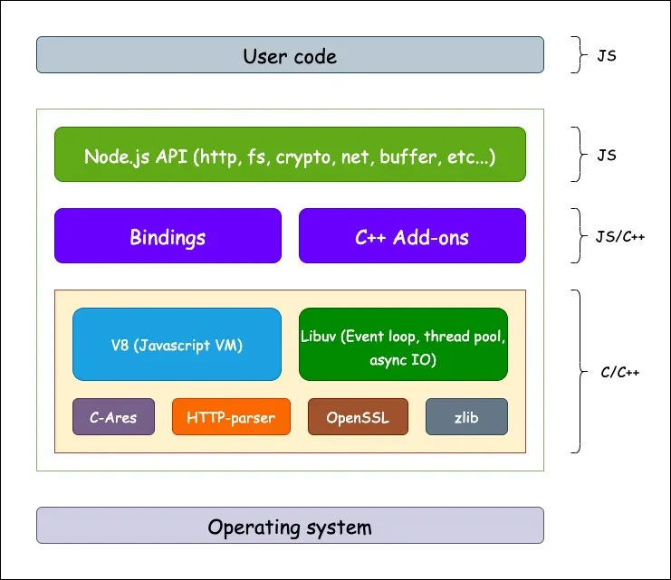

# 📚 **Meaning**
| Language         | Content                          |
| ---------------- | -------------------------------- |
| 🇺🇸 **English** | JS runtime outside the browser   |
| 🇷🇺 **Russian** | Среда выполнения JS вне браузера |
# 🖼️ **Images**

# 📥 **Sources**
<iframe src="https://www.youtube.com/embed/TlB_eWDSMt4" width="560" height="315" frameborder="0" allowfullscreen></iframe>
# 🏷️ **Tags**
#node #runtime #javascript